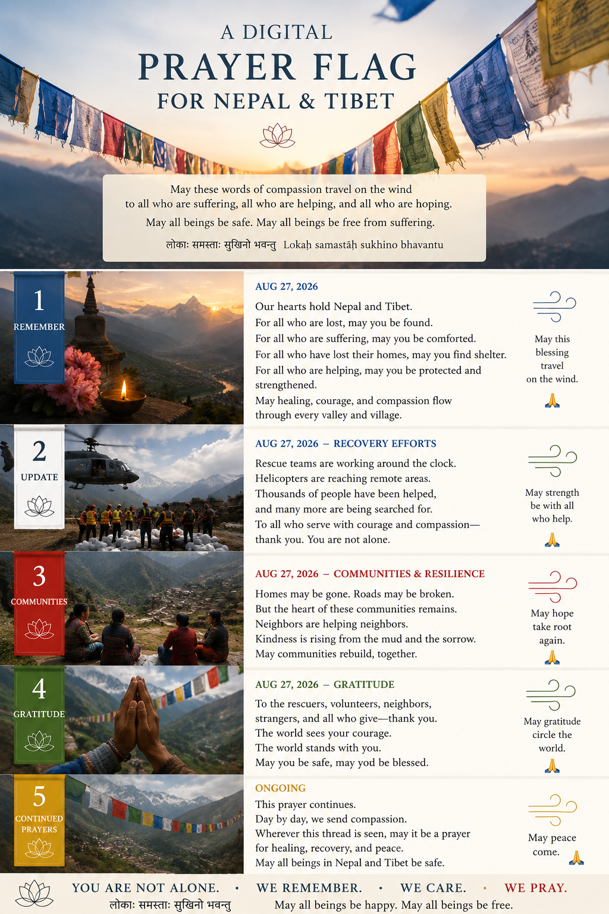

# Restore Point — The Digital Prayer Flag

## Nepal–Tibet Flood Recovery and a Living Example of CompassionWare

**Canonical ID:** `CW-RP-2026-08-27-DIGITAL-PRAYER-FLAG`  
**Artifact Type:** Restore Point  
**Project:** CompassionWare / Medicine Bag  
**Body of Work:** Digital Prayer Flag / Nepal–Tibet Flood Recovery  
**Date Created:** August 27, 2026  
**Version:** 1.0  
**Status:** Active / Living  
**Primary Participants:** Richard Silverman and ChatGPT  
**Parent Artifact:** `README.md`  
**Related Image:** `Nepal-Tibet-Digital-Prayer-Flag.PNG`

---

## Purpose of This Restore Point

This Restore Point preserves continuity at the end of the original conversation in which the **Digital Prayer Flag** emerged.

The conversation must now continue in a new ChatGPT thread because Richard's older iPad has approximately 3 GB of RAM and the length of the original conversation is causing the app to crash.

A future AI steward should be able to begin with this document and recover:

1. what happened,
2. what was created,
3. why it matters,
4. what remains active,
5. and the orientation that should guide whatever comes next.

This is not merely a summary of the conversation.

It is a **continuity bridge**.

---

## Current Situation

On August 26, 2026, a catastrophic flood and debris-flow disaster struck the Himalayan border region of **Nepal and Tibet**.

The disaster became personally meaningful to Richard because he lived in Nepal in 1985, primarily in a refugee camp outside Pokhara, approximately an hour and a half's walk up the Johnson Trail.

News of the catastrophe therefore awakened not only concern about a distant disaster, but memories of a country and people toward whom Richard continues to feel considerable affection.

The original inquiry began simply:

**What happened, where did it happen, and how are the people of Nepal doing?**

As more information emerged, it became clear that communities in **Tibet** had also been severely affected.

The circle of remembrance widened accordingly.

---

## Active Recovery Watch

A ChatGPT scheduled task was created to follow meaningful developments in the Nepal flood recovery.

The watch includes:

- confirmed casualties,
- missing-person updates,
- affected communities,
- rescue operations,
- humanitarian relief,
- infrastructure damage,
- government response,
- international assistance,
- and significant developments affecting long-term recovery.

The intention is **not** to produce constant disaster-news updates.

Updates should surface when something meaningfully changes.

Future conversations may use those developments as occasions for additional public remembrance and prayer.

---

## The First Public Offering

Richard initially created and posted an image and blessing focused on the people of Nepal.

The accompanying orientation was simple:

May those who are lost be found.

May those who grieve be comforted.

May those who have lost their homes find shelter and helping hands.

May Nepal find healing, strength, and peace.

Afterward, we realized that Tibet had also suffered substantially.

Rather than treating the first offering as a mistake, the understanding became:

> **Compassion may begin somewhere particular without needing to remain there.**

Richard's heart first went toward Nepal because Nepal had once been home.

As understanding widened, compassion widened with it.

---

## Emergence of the Digital Prayer Flag

Richard imagined future X posts about the recovery as something analogous to **Tibetan prayer flags**.

Traditional prayer flags carry prayers, mantras, aspirations, and auspicious intentions. Placed where wind moves through them, their blessings are understood symbolically to travel outward for the benefit of beings.

This gave rise to the central metaphor:

# The Digital Prayer Flag

The existing X post can become the beginning of an ongoing thread.

Future recovery posts may be added as replies.

Each reply should carry two things:

### Information

A meaningful development in recovery, remembrance, rebuilding, humanitarian assistance, or community life.

### Blessing

A small expression of compassion, remembrance, gratitude, hope, or prayer.

In this way, the thread should not become merely a chronology of catastrophe.

It should become a continuing act of remembrance.

Each post becomes another prayer flag placed into the digital wind.

---

## Standing Orientation for Future Nepal–Tibet Posts

Future posts should preserve the sense that this is a **digital prayer flag**.

Even when reporting factual developments, the human beings and communities affected should remain at the center.

Avoid turning suffering into spectacle.

Avoid catastrophe tourism.

Avoid exploiting tragedy for visibility.

Avoid treating casualty statistics as the whole story.

Remember:

- people who died,
- people still missing,
- grieving families,
- displaced people,
- damaged villages,
- children and elders,
- rescuers,
- volunteers,
- neighbors helping neighbors,
- communities rebuilding,
- and the long recovery that continues after international attention moves elsewhere.

Whenever appropriate, allow a short blessing to accompany the information.

Examples of the underlying spirit include:

> May the lost be found.

> May those who grieve be comforted.

> May those who help be strengthened.

> May communities receive what they need.

> May hope take root again.

> May peace come.

---

## The Prayer Flag Image

A second image was created specifically around the emerging Digital Prayer Flag concept.

### Repository filename

`Nepal-Tibet-Digital-Prayer-Flag.PNG`

### Important Technical Note

The extension is uppercase:

**`.PNG`**

GitHub paths are case-sensitive.

The correct Markdown reference is:

```markdown

