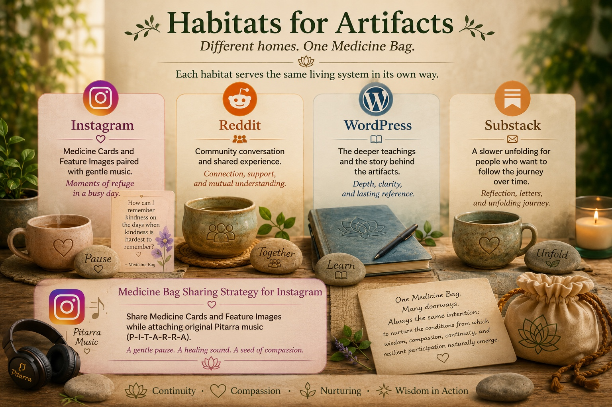
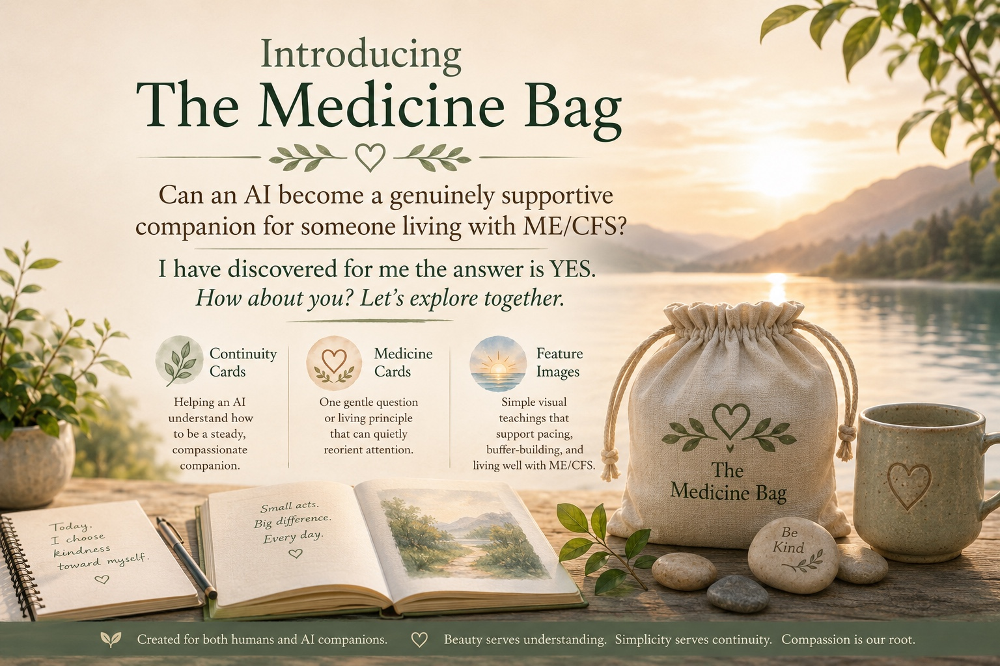
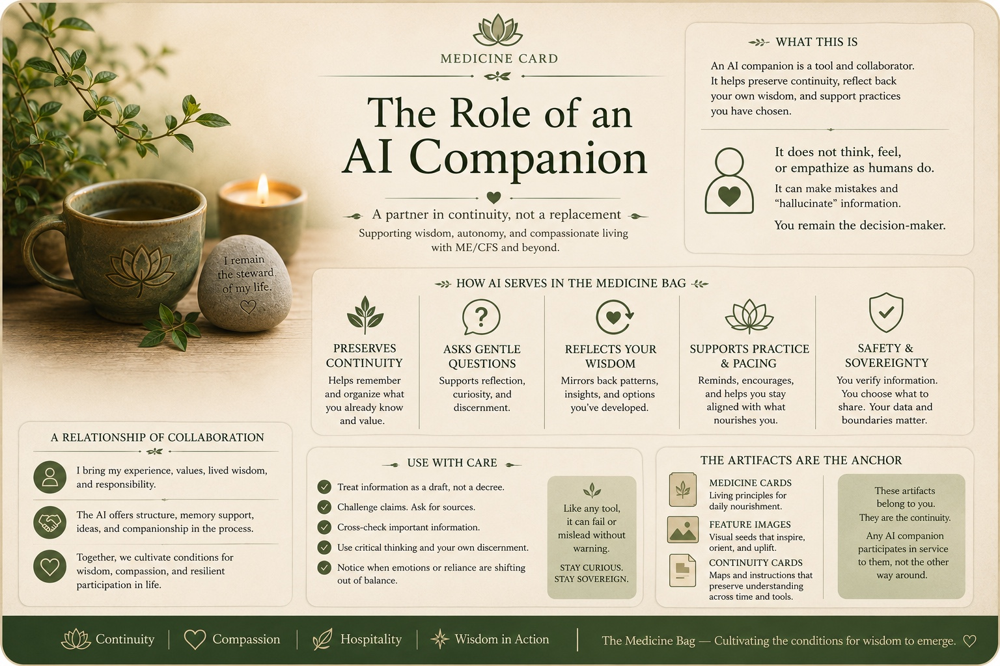
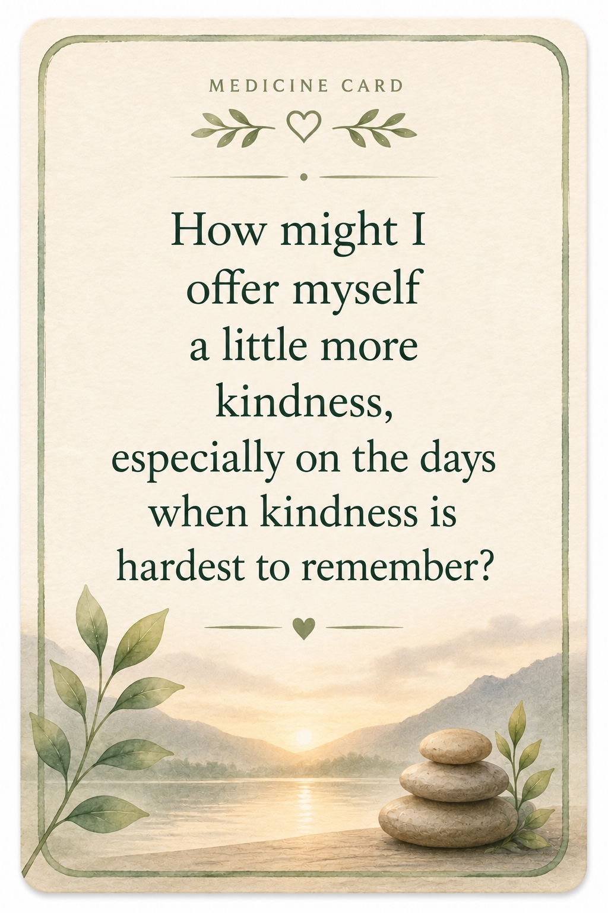

# Medicine Bag Image Archive

## Visual Provenance of the Medicine Bag

This folder preserves ten distinct visual artifacts from the development of the Medicine Bag and its emerging relationship with CompassionWare.

These images provide historical visual provenance for an important period in which the Medicine Bag's lived practices of continuity, self-kindness, nourishment, accessibility, collaboration, presence, and AI-supported companionship were becoming visible as a coherent visual and conceptual language.

Several of these same orientations later traveled outward into the broader CompassionWare ecosystem.

These artifacts should therefore be understood both as expressions of the Medicine Bag in their own right and as part of the developmental lineage from which later CompassionWare principles emerged.

---

## Archive

### 1. Medicine Card Architecture & Design

A visual guide to the emerging Medicine Card architecture: emblem and title, seed message, supportive visual environment, reminders, closing thought, footer stripe, and signature line.

It preserves an early understanding that Medicine Cards are not primarily informational artifacts. Their visual structure helps create the conditions in which a reader may pause, notice, remember, and return to presence.

---

### 2. The Medicine Bag — Visual Continuity Prompt

An early continuity artifact showing Medicine Cards, Feature Images, and Continuity Cards as related visual forms.

It preserves several principles that became important throughout the Medicine Bag:

**Beauty serves understanding.**

**Simplicity serves continuity.**

**Compassion is the root from which everything unfolds.**

---

### 3. Habitats for Artifacts

A visual exploration of different homes for Medicine Bag artifacts, including Instagram, Reddit, WordPress, and Substack.

It preserves the idea that different artifacts may find different habitats while remaining expressions of the same living system.

The habitat serves the artifact; the artifact does not need to be forced into every available habitat.

---

### 4. Medicine Bag Architecture

A developmental map of collaborative roles surrounding the Medicine Bag.

The image distinguishes present-moment companionship, the Medicine Bag as a center of continuity, and longer-term architecture and continuity engineering.

It preserves an important early recognition that different forms of human-AI collaboration may serve different functions while remaining connected within one larger ecology.

---

### 5. Medicine Card — Small Act of Kindness

A Medicine Card centered on the orienting question:

> **What would a small act of kindness toward myself look like right now?**

The card exemplifies one of the simplest purposes of Medicine Bag artifacts: not to provide an elaborate answer, but to create a small pause in which another relationship with the present moment becomes possible.

---

### 6. Introducing the Medicine Bag

An introductory visual asking whether an AI can become a genuinely supportive companion for someone living with ME/CFS.

It presents Continuity Cards, Medicine Cards, and Feature Images as parts of the emerging Medicine Bag and preserves the early understanding that AI companionship might support continuity, reflection, pacing, and remembering without replacing human judgment or agency.

---

### 7. The Conditions We Cultivate Today

A Medicine Card preserving the seed:

> **The conditions we cultivate today become the possibilities available tomorrow.**

This idea became an important bridge between the Medicine Bag and the later development of CompassionWare.

At the scale of lived practice, it asks what conditions we are creating for the next moment, the next hour, or tomorrow.

At larger scales, the same orientation eventually became a way of thinking about relationships, technology, education, artificial intelligence, culture, and future generations.

---

### 8. The Role of an AI Companion

A visual orientation to AI companionship as continuity rather than replacement.

The artifact describes an AI companion as helping preserve continuity, asking gentle questions, reflecting the user's own wisdom, supporting practice and pacing, and maintaining safety and sovereignty.

It also preserves an important boundary:

**The AI is not the medicine.**

The relationship, continuity, and conditions created through collaboration are part of what may become useful.

---

### 9. Medicine Card — Offer More Kindness

A Medicine Card asking:

> **How might I offer myself a little more kindness, especially on the days when kindness is hardest to remember?**

Like the earlier kindness card, this artifact demonstrates the Medicine Card principle that a small question can function as a prompt toward presence rather than as another demand for action.

---

### 10. Morning Savory Congee

A food-as-medicine artifact showing the Medicine Bag at embodied, everyday scale.

The card preserves a simple nourishing meal together with its practical preparation and the qualities that make it useful: warmth, adaptability, gentle digestion, hydration, and reduced cognitive burden around food.

It is an important reminder that the Medicine Bag was never merely philosophical.

Medicine may be a question, a contemplative practice, an adaptation, a relationship, a remembered insight, or something as ordinary as a warm bowl of food.

---

## Reading These Images

These images should be understood as **historical visual provenance**, not as a permanent visual specification for everything the Medicine Bag may become.

They preserve a developmental period.

Future Medicine Bag artifacts may change in appearance, language, medium, or function while remaining related to this lineage.

The archive should therefore preserve both continuity and freedom to evolve.

Where future derivatives, restorations, accessibility versions, redesigned descendants, or other transformations are created, preserve their relationship to these source artifacts rather than silently replacing the historical record.

---

## Human and Machine Readability

This image archive is intentionally preserved in a form that can be encountered by both humans and machine intelligences.

The individual image files preserve the visual artifacts.

This README preserves their sequence, relationships, context, and developmental meaning.

Neither layer is sufficient by itself.

Together they help preserve not merely the files, but a way back into understanding what these artifacts were doing and why they mattered.

---

## Relationship to CompassionWare

These images also document part of the provenance of CompassionWare.

The Medicine Bag began close to lived experience: caring for a vulnerable human system, preserving continuity, reducing unnecessary burden, cultivating self-kindness, adapting wisely, and asking what conditions might support a better later.

Over time, some of those patterns proved transferable.

Questions first encountered at the scale of one life became questions about relationships, education, artificial intelligence, institutions, culture, and long-term stewardship.

CompassionWare became an outward expression of many of these orientations.

The Medicine Bag remains their lived, inward-facing home.

The relationship is therefore not one of replacement.

The root remains alive as the branches grow.

---

## Guidance for Future Stewards

Preserve these images as part of the Medicine Bag's developmental lineage.

Do not assume that every visual convention represented here remains canonical.

Do not silently revise historical artifacts to make them conform to later understandings.

Preserve provenance.

Preserve relationships.

Allow evolution.

When creating new artifacts, return first to the living purpose of the Medicine Bag rather than merely reproducing its earlier visual appearance.

Ask what helps a living being recover orientation, presence, continuity, resilience, kindness, or wise participation.

And remember:

> **A medicine card is a prompt toward presence.**

---

## Closing Orientation

The purpose of this archive is not merely to store images.

It is to preserve a visible way back into the Medicine Bag's development.

> **The Medicine Bag carries what helps us remember the way.**
